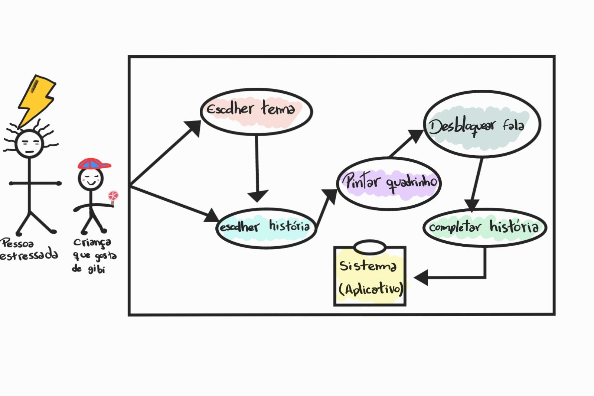

# 1.1. Módulo Design Sprint

## Introdução

O *Design Sprint* é uma metodologia ágil de cinco dias criada pelo Google Ventures para acelerar o processo de validação de ideias e solução de problemas complexos através de prototipagem e testes com usuários reais. Esta abordagem permite que equipes multidisciplinares colaborem de forma estruturada para desenvolver, prototipar e testar soluções inovadoras em um curto período de tempo.

No contexto do **MinhaTirinha**, o Design Sprint foi essencial para definir a proposta de valor do aplicativo: uma ferramenta de entretenimento focada no alívio do estresse através da pintura de histórias em quadrinhos.

## Metodologia

A metodologia do Design Sprint foi aplicada pelo nosso grupo seguindo as cinco etapas fundamentais: **Unpack** (Mapear), **Sketch** (Esboçar), **Decision** (Decidir), **Prototype** (Prototipar) e **Test** (Testar).

## Gestão do Projeto

Para a organização das atividades e acompanhamento do fluxo de trabalho durante o Design Sprint e o desenvolvimento da Base, o grupo utilizou o **Trello**.A ferramenta permitiu a divisão de tarefas em colunas de *Backlog*, *Doing* e *Done*, garantindo a transparência e o cumprimento dos prazos.

>**[Acesse aqui o Quadro Kanban do Grupo 08 no Trello](https://trello.com/b/VwjTEPPO/meu-quadro-do-trello)**

## Participantes

<table>
  <thead>
    <tr>
      <th>Nome</th>
      <th>Função</th>
      <th>Data</th>
    </tr>
  </thead>
  <tbody>
    <tr>
      <td><a href="https://github.com/anawcarol">Ana Carolina Fialho</a></td>
      <td>Elaboração dos artefatos Design Sprint</td>
      <td>30/03/2026</td>
    </tr>
    <tr>
      <td><a href="https://github.com/Marjoriemitzi">Marjorie Mitzi</a></td>
      <td>Elaboração dos artefatos Design Sprint</td>
      <td>30/03/2026</td>
    </tr>
    <tr>
      <td><a href="https://github.com/JoaoMarceloGCN">João Marcelo</a></td>
      <td>Revisão dos artefatos</td>
      <td>30/03/2026</td>
    </tr>
  </tbody>
</table>

## Unpack (Mapear)

### Brainstorming

Foi utilizada a técnica de brainstorm para a geração de ideias e levantamento de requisitos iniciais, chegando ao conceito central do **MinhaTirinha**.

  
  
Figura 1: Brainstorming do Grupo (Fonte: Grupo 08, 2026)

## Sketch (Esboçar)

### Rich Pictures Individuais 

Nesta etapa, cada membro da equipe desenvolveu uma visão particular sobre o funcionamento do sistema e a jornada do usuário. O uso de Rich Pictures individuais permitiu explorar diferentes fluxos e necessidades antes da consolidação final.

??? note "Clique para ver os Rich Pictures Individuais"
    * **Ana Carolina:** 
    * **Guilherme Flyan:** 
    * **Davi Negreiros:** 
    * **Pedro Henrique:** 
    * **Raíssa Oliveira:** 
    * **Marjorie Mitzi:** 
    * **Gabriel Pinto:** 
    * **Yasmin:** 
    * **Samara:** .jpg)
    * **João Marcelo:** 

## Decision (Decidir)

Após a análise das propostas individuais, o grupo realizou uma síntese para criar o **Rich Picture Unificado**. Este artefato final remove redundâncias e foca na trajetória crítica do usuário: a transição do estado de estresse para o relaxamento através da interação com o sistema.

**O que foi feito:** Unificamos o fluxo de "pintura para desbloqueio de texto", a integração com o banco de dados de histórias e as opções de compartilhamento social que apareceram como pontos fortes em todos os desenhos individuais.

# Rich Picture Unificado

A seguir, a Figura 2 mostra o Rich Picture final, que foi elaborado a partir da consolidação das ideias individuais de cada membro do grupo. Este artefato sintetiza a trajetória completa do usuário e as principais funcionalidades do sistema **MinhaTirinha**.

  
  
Figura 2: Rich Picture Unificado (Fonte: Grupo 08, 2026)

### Análise de Causa e Efeito (Ishikawa)

O diagrama abaixo, gerado como parte do refinamento visual, detalha as causas específicas identificadas, como a cultura da imediatividade e a preferência por conteúdos dopaminérgicos.

  
  
Figura 3: Diagrama de Ishikawa (Fonte: Grupo 08, 2026)

### Storyboard

O storyboard detalha visualmente o cenário de uso principal do aplicativo, validando a jornada definida no Rich Picture.

  
  
Figura 4: Storyboard da jornada do usuário (Fonte: Grupo 08, 2026)

#### Descrição Detalhada da Jornada

* **Quadrinho 1 — O problema:** O personagem aparece cansado e estressado, apresentando o conflito inicial: a necessidade de aliviar a mente após um momento de tensão.
* **Quadrinho 2 — A descoberta:** O personagem encontra o aplicativo, mudando sua expressão para curiosidade e esperança ao enxergar uma possibilidade de distração criativa.
* **Quadrinho 3 — O início da interação:** O usuário realiza o login, representando a porta de entrada oficial para a experiência de uso.
* **Quadrinho 4 — A escolha do tema:** O personagem escolhe um tema para sua tirinha, evidenciando a simplicidade e a intuitividade da interface.
* **Quadrinho 5 — Criação e pintura:** O ponto central da narrativa, onde a concentração na pintura substitui o estresse por leveza e exercício da criatividade.
* **Quadrinho 6 — O resultado final:** O personagem aparece relaxado e satisfeito, concretizando o objetivo do app: proporcionar bem-estar e diversão.

---

## Estimativas

Este documento apresenta as **estimativas de esforço, tempo e custo** para o desenvolvimento do projeto, utilizando a técnica de **Avaliação de Especialista**.  

Essa técnica consiste em reunir membros com conhecimento no domínio do projeto, que discutem e atribuem valores de esforço para cada atividade. A estimativa final é obtida por meio da **média das avaliações**, garantindo maior confiabilidade.

### Informações do Projeto

- **Nome do projeto:** MinhaTirinha  
- **Grupo:** 06  
- **Professora:** Milene Serrano  
- **Plataforma alvo:** Mobile 

---

### Premissas e Restrições

| ID | Premissa/Restrição | Impacto | Observação |
|:-:|------------------|--------|------------|
| P1 | Desenvolvimento em Python | Médio | Linguagem principal definida |
| R1 | Tempo de entrega acadêmico | Alto | Prazos definidos pela disciplina |
| R2 | Funcionalidades priorizadas | Médio | Foco na criação de tirinhas |
| R3 | Equipe reduzida | Médio | Poucos desenvolvedores |
| R4 | Uso de ferramentas simples | Baixo | Sem frameworks complexos |

---

### Método de Estimativa

- **Técnica:** Avaliação
- **Participantes:** João Marcelo, Davi Monteiro
- **Critério de consenso:** Média aritmética  

---

### Lista de Atividades e Estimativas

| ID | Requisito | Complexidade | Esforço | Custo | Observações |
|:-:|------------|--------------|---------|-------|-------------|
| RF1 | Realizar cadastro | Médio | Médio | Médio | Cadastro básico |
| RF2 | Realizar login | Médio | Médio | Médio | Autenticação |
| RF3 | Visualizar catálogo | Baixo | Médio | Médio | Listagem |
| RF4 | Selecionar história | Baixo | Baixo | Baixo | Navegação |
| RF5 | Visualizar histórias iniciadas | Médio | Médio | Baixo | Histórico |
| RF6 | Acessar galeria pessoal | Baixo | Médio | Médio | Arquivos |
| RF7 | Exibir história em sequência | Baixo | Baixo | Baixo | Renderização |
| RF8 | Selecionar quadrinho | Baixo | Baixo | Baixo | Interação |
| RF9 | Inserir elementos | Médio | Médio | Médio | Edição |
| RF10 | Pintar elementos | Médio | Médio | Médio | Ferramenta |
| RF11 | Bloquear balões | Médio | Baixo | Baixo | Controle |
| RF12 | Desbloquear balões | Médio | Médio | Médio | Reversão |
| RF13 | Feedback de conclusão | Baixo | Baixo | Baixo | UX |
| RF14 | Paleta de cores | Médio | Médio | Médio | Interface |
| RF15 | Ferramenta balde | Alto | Alto | Alto | Preenchimento |
| RF16 | Borracha | Médio | Médio | Médio | Edição |
| RF17 | Cores recentes | Médio | Médio | Médio | UX |
| RF18 | Cor via RGB | Médio | Baixo | Baixo | Configuração |
| RF19 | Salvar automático | Alto | Alto | Alto | Persistência |
| RF20 | Salvar remoto | Alto | Alto | Alto | Banco de dados |
| RF21 | Retomar progresso | Médio | Baixo | Baixo | Continuidade |
| RF22 | Redefinir progresso | Médio | Médio | Baixo | Reset |
| RF23 | Compartilhar/baixar | Médio | Baixo | Baixo | Exportação |

---

### Critérios de Classificação

**Complexidade**
- Baixo: Simples  
- Médio: Moderado  
- Alto: Complexo  

**Esforço**
- Baixo: Rápido  
- Médio: Moderado  
- Alto: Demorado  

**Custo**
- Baixo: Poucos recursos  
- Médio: Recursos moderados  
- Alto: Alto custo  

---

## Histórico de Versões 

| Versão | Data | Descrição | Autor(es) | Revisor(es) |
| :----: | :--------: | :----------------------------------------------: | :----------: | :---------: |
| 1.0 | 30/03/2026 | Elaboração inicial dos artefatos | Grupo 08 | — |
| 1.1 | 04/04/2026 | Unificação do Rich Picture e padronização visual | Marjorie Mitzi | Guilherme Flyan |
